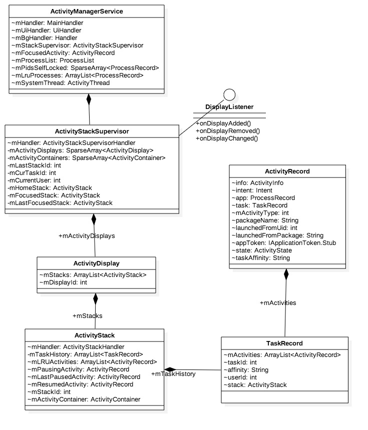
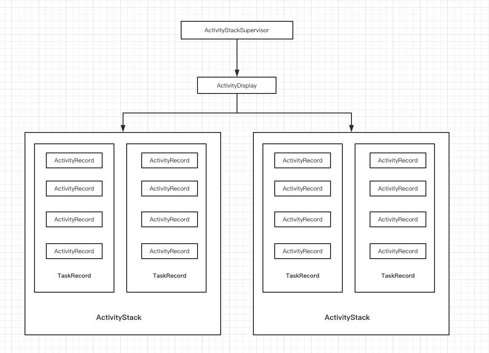
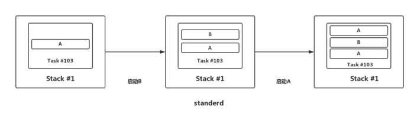
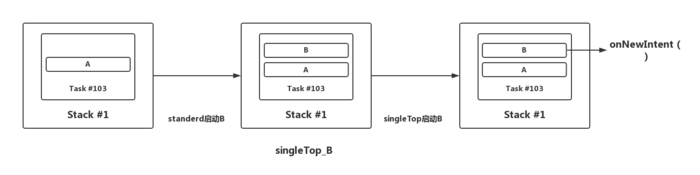
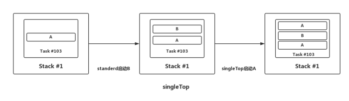
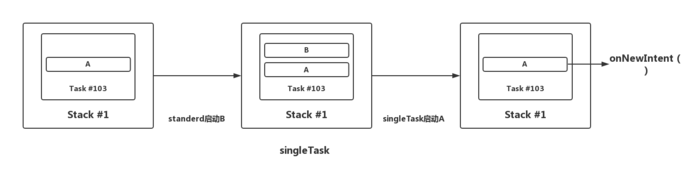
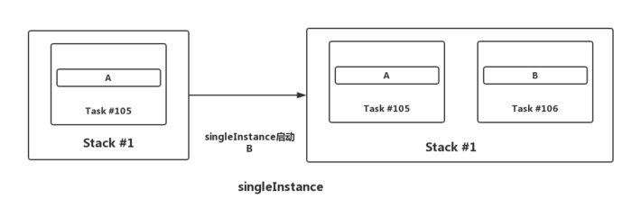

每一个ActivityRecord都会有一个Activity与之对应，一个Activity可能会有多个ActivityRecord，因为Activity可以被多次实例化，取决于其launchmode。一系列相关的ActivityRecord组成了一个TaskRecord，TaskRecord是存在于ActivityStack中，ActivityStackSupervisor是用来管理这些ActivityStack的。

* ActivityRecord: 记录着Activity信息
* TaskRecord: 记录着task信息
* ActivityStack: 栈信息

## ActivityRecord
Activity的信息记录在ActivityRecord对象, 并通过通过成员变量task指向TaskRecord

* ProcessRecord app //跑在哪个进程
* TaskRecord task //跑在哪个task
* ActivityInfo info // Activity信息
* int mActivityType //Activity类型
* ActivityState state //Activity状态
* ApplicationInfo appInfo //跑在哪个app
* ComponentName realActivity //组件名
* String packageName //包名
* String processName //进程名
* int launchMode //启动模式
* int userId // 该Activity运行在哪个用户id

## TaskRecord

Task的信息记录在TaskRecord对象.

* ActivityStack stack; //当前所属的stack
* ArrayList mActivities; // 当前task的所有Activity列表
int taskId
* String affinity； 是指root activity的affinity，即该Task中第一个Activity;
* int mCallingUid;
* String mCallingPackage； //调用者的包名

## ActivityStack
* ArrayList mTaskHistory //保存所有的Task列表
* ArrayList mStacks; //所有stack列表
* final int mStackId;
* int mDisplayId;
* ActivityRecord mPausingActivity //正在pause
* ActivityRecord mLastPausedActivity
* ActivityRecord mResumedActivity //已经resumed
* ActivityRecord mLastStartedActivity

## ActivityStackSupervisor
* ActivityStack mHomeStack //桌面的stack
* ActivityStack mFocusedStack //当前聚焦stack
* ActivityStack mLastFocusedStack //正在切换
* SparseArray mActivityDisplays //displayId为key
* SparseArray mActivityContainers // mStackId为key

## Activity栈关系

* 一般地，对于没有分屏功能以及虚拟屏的情况下，ActivityStackSupervisor与ActivityDisplay都是系统唯一；
* ActivityDisplay主要有Home Stack(Launcher等)和App Stack(应用相关)这两个栈；
* 每个ActivityStack中可以有若干个TaskRecord对象；
* 每个TaskRecord包含如果个ActivityRecord对象；
* 每个ActivityRecord记录一个Activity信息。

看完上面的介绍，再来看看Activity的四种启动模式。

 **standard** ： Activity的默认启动模式，在这种模式下启动的activity可以被多次实例化。
 

 **singleTop**：如果要启动的Activity已经在栈顶，则不会重新创建Activity，只会调用该该Activity的onNewIntent()方法。
 
 
 
如果要启动的Activity不在栈顶，则会重新创建该Activity的实例。
 
 

 **singleTask**：这种启动模式的Activity 会在其所在的任务栈中始终保持只有一个实例，当启动这个Activity的时候，系统会搜寻系统中现存的任务栈，如果没有任务栈中有该Activity的实例，则会创建这个Activity属于的任务栈，并正常创建该Activity 实例，否则会把这个任务栈调到前台，且会将任务栈中其实例以上的所有Activity出栈，并调用该实例的onNewIntent()方法将Intent对象传递到这个实例当中。
 
 

 **singleInstance**：基本和singleTask一样，不同的是启动Activity时，首先要创建在一个新栈，然后创建该Activity实例并压入新栈中，新栈中只会存在这一个Activity实例。
 
 