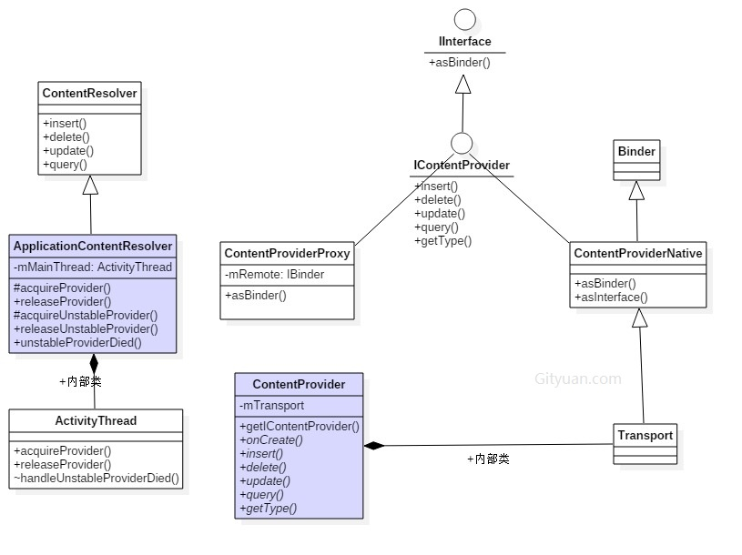

ContentProvider(内容提供者)用于提供数据的统一访问格式，封装底层的具体实现。对于数据的使用者来说，无需知晓数据的来源是数据库、文件，或者网络，只需简单地使用ContentProvider提供的数据操作接口，也就是增(insert)、删(delete)、改(update)、查(query)四个过程。

## ContentProvider

ContentProvider作为Android四大组件之一，并没有Activity那样复杂的生命周期，只有简单地onCreate过程。ContentProvider是一个抽象类，当实现自己的ContentProvider类，只需继承于ContentProvider，并且实现以下六个abstract方法即可：

* insert(Uri, ContentValues)：插入新数据；
* delete(Uri, String, String[])：删除已有数据；
* update(Uri, ContentValues, String, String[])：更新数据；
* query(Uri, String[], String, String[], String)：查询数据；
* onCreate()：执行初始化工作；
* getType(Uri)：获取数据MIME类型。

## ContentResolver

其他app或者进程想要操作ContentProvider，则需要先获取其相应的ContentResolver，再利用ContentResolver类来完成对数据的增删改查操作

```
ContentResolver cr = getContentResolver();  //获取ContentResolver
Uri uri = Uri.parse("content://com.gityuan.articles/android/3");
Cursor cursor = cr.query(uri, null, null, null, null);  //执行查询操作
...
cursor.close(); //关闭
```
## 继承关系图


## 进程不存在


1. client进程：通过binder(调用AMS.getContentProviderImpl)向system_server进程请求相应的provider；
2. system进程：如果目标provider所对应的进程尚未启动，system_server会调用startProcessLocked来启动provider进程； 当进程启动完成，此时cpr.provider ==null，则system_server便会进入wait()状态，等待目标provider发布；
3. provider进程：进程启动后执行完attch到system_server，紧接着执行bindApplication；在这个过程会installProvider以及 publishContentProviders；再binder call到system_server进程；
4. system进程：再回到system_server，发布provider信息，并且通过notify机制，唤醒前面处于wait状态的binder线程；并将 getContentProvider的结果返回给client进程；
5. client进程：接着执行installProvider操作，安装provider的(包含对象记录,引用计数维护等工作)；

## 进程存在


* Client进程在获取provider的过程,发现cpr为空,则调用scheduleInstallProvider来向provider所在进程发出一个oneway的binder请求,并进入wait()状态.
* provider进程安装完provider信息,则notifyAll()处于等待状态的进程/线程;

如果provider在publish完成之后, 这时再次请求该provider,那就便没有的最右侧的这个过程,直接在AMS.getContentProviderImpl之后便进入AT.installProvider的过程,而不会再次进入wait()过程.