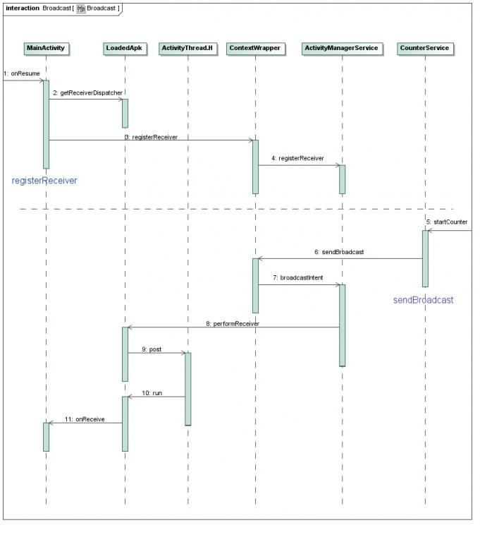

在Android系统中，广播是一种在组件之间进行消息传递的方式。广播机制是一种基于消息发布和订阅的事件驱动模型，即广播发送着负责发布消息，而接受着需要先订阅消息，然后才能接到消息。

广播机制存在一个注册中心，由ActivityManagerService担任。广播接受者订阅消息的表现形式就是将自己注册到AMS中，并指定要接受的广播的类型。广播发送者发送广播时，首先发送到AMS，然后AMS根据这个广播的类型找到相应的广播接受者，最后将这个广播发送它们处理。

BroadcastReceiver分为两类：

* 静态广播接收者：通过AndroidManifest.xml的标签来申明的BroadcastReceiver。
* 动态广播接收者：通过AMS.registerReceiver()方式注册的BroadcastReceiver，动态注册更为灵活，可在不需要时通过unregisterReceiver()取消注册。

从广播发送方式可分为：

* 普通广播：通过Context.sendBroadcast()发送，可并行处理
* 有序广播：通过Context.sendOrderedBroadcast()发送，串行处理

## 广播的注册和发送的过程时序图

注册：在ActivityManagerService中，用一个进程记录块来表示这个应用程序进程，它里面有一个列表receivers，专门用来保存这个进程注册的广播接收器。接着，又把这个ReceiverList列表以receiver为Key值保存在ActivityManagerService的成员变量mRegisteredReceivers中，这些都是为了方便在收到广播时，快速找到对应的广播接收器的。

发送：

1. 通过sendBroadcast把一个广播通过Binder进程间通信机制发送给ActivityManagerService，ActivityManagerService根据这个广播的Action类型找到相应的广播接收器，然后把这个广播放进自己的消息队列中去，就完成第一阶段对这个广播的异步分发了。

2. ActivityManagerService在消息循环中处理这个广播，并通过Binder进程间通信机制把这个广播分发给注册的广播接收分发器ReceiverDispatcher，ReceiverDispatcher把这个广播放进MainActivity所在的线程的消息队列中去，就完成第二阶段对这个广播的异步分发了。

3. ReceiverDispatcher的内部类Args在MainActivity所在的线程消息循环中处理这个广播，最终是将这个广播分发给所注册的BroadcastReceiver实例的onReceive函数进行处理