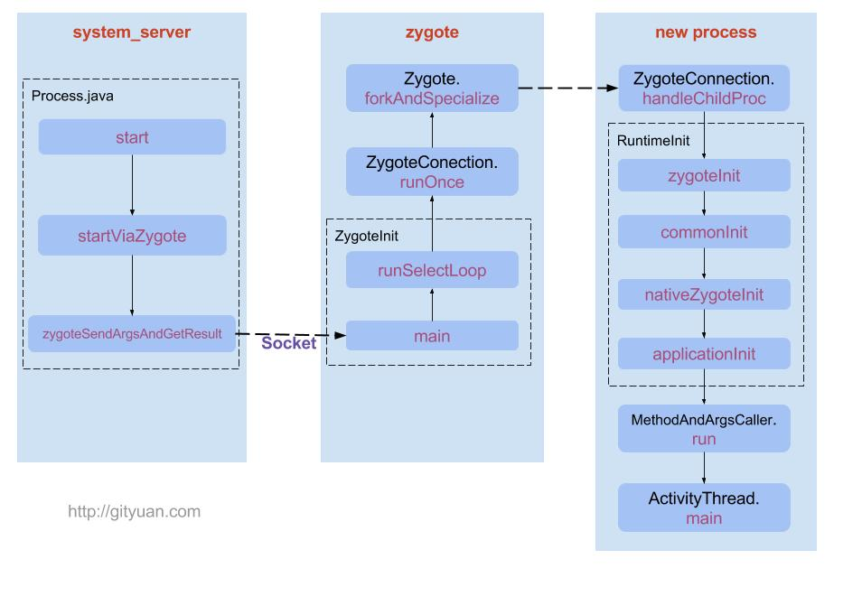

ActivityManagerService(AMS)在启动一个应用程序组件时，如果发现这个组件所需要的应用程序进程还没有启动起来，AMS就会请求Zygote进程将这个应用进程启动起来。

进程创建的流程如下图(图片来自Gityuan博客)

system_server进程通过Socket连接到zygote进程(zygote进程创建时就有一个Socket服务等待连接)，将要创建的应用程序进程的启动参数传给zygote进程。zygote进程fork创建一个新的应用程序进程，并将这个新创建的进程PID返回给AMS。

Zygote进程是通过复制自身的方式来创建一个新的应用程序进程。由于Zygote进程在启动的时候会在内部创建一个虚拟机实例，因此，通过复制它而得到的应用程序进程就很自然得获得了一个虚拟机实例的拷贝。有了这个虚拟机实例后，这个应用程序进程就可以将使用Java开发的应用程序组件运行起来了。

应用程序进程在启动的过程中还会创建一个Binder线程池和一个消息循环。

