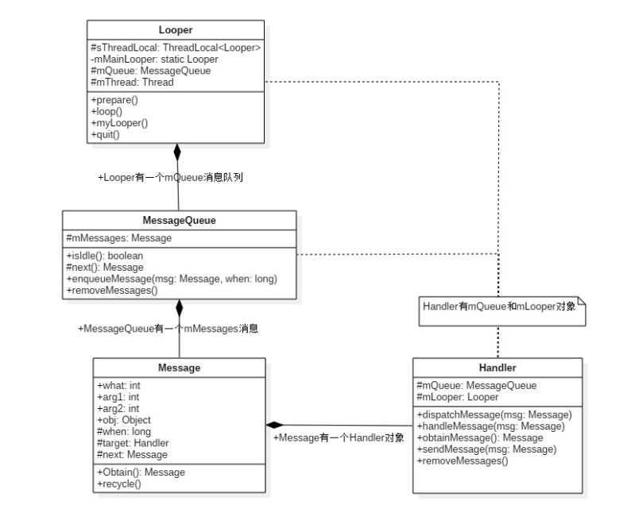
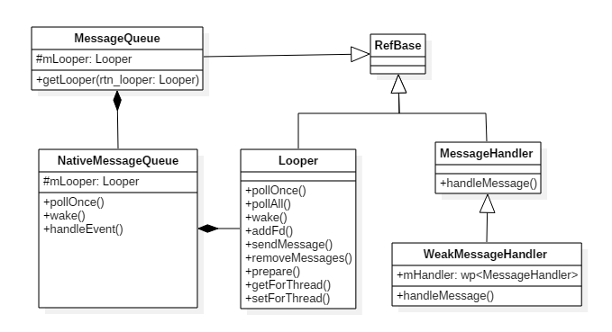
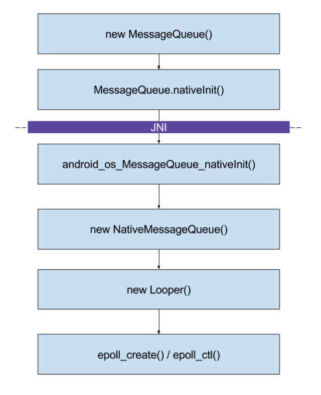
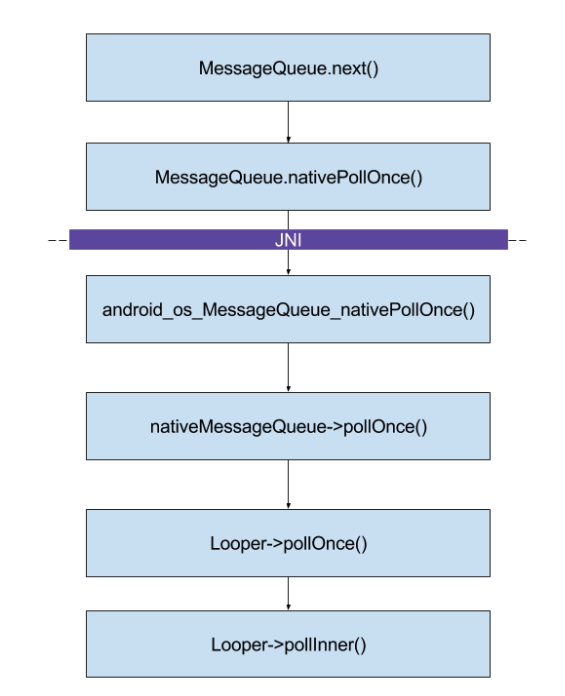
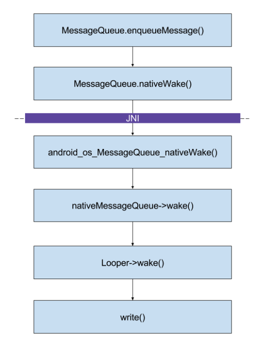
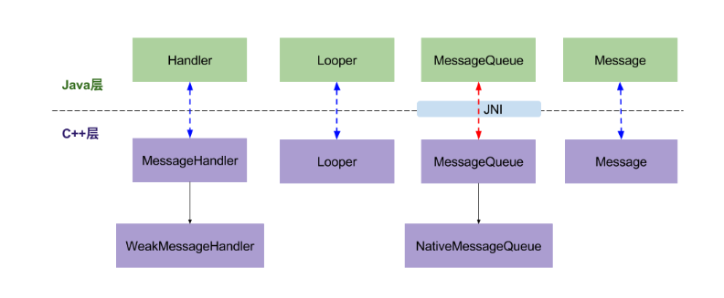
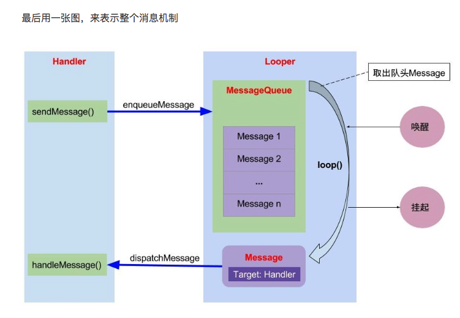

Android应用程序使用消息来驱动。Android应用程序的每一个线程在启动时，都可以首先在内部创建一个消息队列，然后进入一个无限循环中，不断检查它的消息队列中是否有新的消息需要处理，那么线程就会将它从消息队列中取出，并对它进行处理，否则线程就会进入休眠等待状态。

Android系统主要通过MessageQueue、Looper和Handler三个类来实现Android消息处理机制。MessageQueue用来描述消息队列；Looper用来创建消息队列，以及进入消息循环；Handler用来发送和处理消息。

Android应用程序的消息处理机制不仅在Java代码中使用，还可以在C++代码中使用。

## Java层
### 架构图



	Looper有一个MessageQueue消息队列；
	MessageQueue有一组待处理的Message；
	Message中有一个用于处理消息的Handler；
	Handler中有Looper和MessageQueue。


### 1.1创建消息队列
Android应用程序消息队列MessageQueue，它可以通过Looper类的静态成员函数prepareMainLooper(主线程)或者prepare(子线程)创建，并且会在C++层中创建一个NativeMessageQueue对象【跳转2.1】。

### 1.2 loop
消息队列创建完成后调用Looper.loop(),进入循环模式，不断重复下面的操作，直到没有消息时退出循环：

	调用MessageQueue.next取出下一条Message；
	把Message分发给相应的target；
	再把分发后的Message回收到消息池，以便重复利用。
	
#### MessageQueue.next
从MessageQueue中提取下一条message。

当前线程如何得知自己是否有新的消息需要处理？【跳转2.2】	


### 1.3 消息发送
消息发送有很多方法，最终调用的都是MessageQueue.enqueueMessage(),将消息添加到消息队列中，when为系统当前的运行时间，不包括休眠时间。

```
boolean enqueueMessage(Message msg, long when) {
    // 每一个普通Message必须有一个target
    if (msg.target == null) {
        throw new IllegalArgumentException("Message must have a target.");
    }
    if (msg.isInUse()) {
        throw new IllegalStateException(msg + " This message is already in use.");
    }
    synchronized (this) {
        if (mQuitting) {  //正在退出时，回收msg，加入到消息池
            msg.recycle();
            return false;
        }
        msg.markInUse();
        msg.when = when;
        Message p = mMessages;
        boolean needWake;
        if (p == null || when == 0 || when < p.when) {
            //p为null(代表MessageQueue没有消息） 或者msg的触发时间是队列中最早的， 则进入该该分支
            msg.next = p;
            mMessages = msg;
            needWake = mBlocked; //当阻塞时需要唤醒
        } else {
            //将消息按时间顺序插入到MessageQueue。一般地，不需要唤醒事件队列，除非
            //消息队头存在barrier，并且同时Message是队列中最早的异步消息。
            needWake = mBlocked && p.target == null && msg.isAsynchronous();
            Message prev;
            for (;;) {
                prev = p;
                p = p.next;
                if (p == null || when < p.when) {
                    break;
                }
                if (needWake && p.isAsynchronous()) {
                    needWake = false;
                }
            }
            msg.next = p;
            prev.next = msg;
        }
        //消息没有退出，我们认为此时mPtr != 0
        if (needWake) {
            nativeWake(mPtr);
        }
    }
    return true;
}
```
MessageQueue是按照Message触发时间的先后顺序排列的，队头的消息是将要最早触发的消息。当有消息需要加入消息队列时，会从队列头开始遍历，直到找到消息应该插入的合适位置，以保证所有消息的时间顺序。

1. 当插入的消息在目标消息队列的中间，由于目标消息队列头部没有发生变化，当前线程不需要对目标线程执行唤醒操作
2. 当插入的消息在目标消息队列的头部，当前线程就需要将目标线程唤醒，使目标线程可以处理消息队列头部的消息。如果目标线程休眠，就要调用nativeWake()方法将其唤醒。【跳转2.3】

### 1.4 消息分发
在Looper.loop()中，当发现有消息时，Message中有一个用于处理消息的Handler,调用消息的目标handler，执行dispatchMessage()方法来分发消息。

```
public void dispatchMessage(Message msg) {
    if (msg.callback != null) {
        //当Message存在回调方法，回调msg.callback.run()方法；
        handleCallback(msg);
    } else {
        if (mCallback != null) {
            //当Handler存在Callback成员变量时，回调方法handleMessage()；
            if (mCallback.handleMessage(msg)) {
                return;
            }
        }
        //Handler自身的回调方法handleMessage()
        handleMessage(msg);
    }
}
```

1. 当Message的回调方法不为空时，则回调方法msg.callback.run()，其中callBack数据类型为Runnable,否则进入步骤2；
2. 当Handler的mCallback成员变量不为空时，则回调方法mCallback.handleMessage(msg),否则进入步骤3；
3. 调用Handler自身的回调方法handleMessage()，该方法默认为空，Handler子类通过覆写该方法来完成具体的逻辑。

平时开发中最常使用的是第三种情况，通过覆写handleMessage方法来实现自己的业务逻辑。


## Native层
### Native架构图


### 2.1 创建消息队列
Java层MessageQueue创建过程中调用NativeInit方法，它是由C++层中的`android_os_MessageQueue_nativeInit`方法实现。然后由它在C++层`new MessageQueue()`、`new Looper()`。

在C++层Looper中创建了一个管道pipe，这个管道在一个线程的消息循环过程中起到了非常大的作用。

```
void Looper::rebuildEpollLocked() {
    if (mEpollFd >= 0) {
        close(mEpollFd); //关闭旧的epoll实例
    }
    mEpollFd = epoll_create(EPOLL_SIZE_HINT); //创建新的epoll实例，并注册wake管道
    struct epoll_event eventItem;
    memset(& eventItem, 0, sizeof(epoll_event)); //把未使用的数据区域进行置0操作
    eventItem.events = EPOLLIN; //可读事件
    eventItem.data.fd = mWakeEventFd;
    //将唤醒事件(mWakeEventFd)添加到epoll实例(mEpollFd)
    int result = epoll_ctl(mEpollFd, EPOLL_CTL_ADD, mWakeEventFd, & eventItem);

    for (size_t i = 0; i < mRequests.size(); i++) {
        const Request& request = mRequests.valueAt(i);
        struct epoll_event eventItem;
        request.initEventItem(&eventItem);
        //将request队列的事件，分别添加到epoll实例
        int epollResult = epoll_ctl(mEpollFd, EPOLL_CTL_ADD, request.fd, & eventItem);
        if (epollResult < 0) {
            ALOGE("Error adding epoll events for fd %d while rebuilding epoll set, errno=%d", request.fd, errno);
        }
    }
}
```

通过[Linux epoll机制](https://david1840.github.io/2018/07/21/I-O%E5%A4%9A%E8%B7%AF%E8%BD%AC%E6%8D%A2select%E3%80%81poll/)，当一个线程没有新的消息时，它就会休眠在这个管道的读端文件描述符上，直到有新的消息需要处理；其次，当其他线程向这个线程的消息队列发送一个消息后，其他线程就会通过这个管道的写端文件描述符往这个管道写入一个数据，从而唤醒这个线程，以便它可以对刚才发送给它的消息队列中的数据进行处理。



### 2.2 取出消息

MessageQueue.next中调用nativePollOnce方法，最终调用到C++层的Lopper.pollInner，使用epoll_wait方法监听2.1中创建的epoll实例的IO读写事件。



### 2.3 发送消息

向目标线程发送数据，如果线程处于休眠状态，就要先将其唤醒。在2.1中知道线程使用epoll机制监听是否需要处理消息。所以当前线程要唤醒目标线程就只要向它的写端文件描述符写入一个字符，就可以将其唤醒。




## Java层 和 Native层



* 红色虚线关系：Java层和Native层的MessageQueue通过JNI建立关联，彼此之间能相互调用，搞明白这个互调关系，也就搞明白了Java如何调用C++代码，C++代码又是如何调用Java代码。
* 蓝色虚线关系：Handler/Looper/Message这三大类Java层与Native层并没有任何的真正关联，只是分别在Java层和Native层的handler消息模型中具有相似的功能。都是彼此独立的，各自实现相应的逻辑。
* WeakMessageHandler继承于MessageHandler类，NativeMessageQueue继承于MessageQueue类

另外，消息处理流程是先处理Native Message，再处理Native Request，最后处理Java Message。理解了该流程，也就明白有时上层消息很少，但响应时间却较长的真正原因。


## 总结


* Handler通过sendMessage()发送Message到MessageQueue队列；
* Looper通过loop()，不断提取出达到触发条件的Message，并将Message交给target来处理；
* 经过dispatchMessage()后，交回给Handler的handleMessage()来进行相应地处理。
* 将Message加入MessageQueue时，处往管道写入字符，可以会唤醒loop线程；如果MessageQueue中没有Message，并处于Idle状态，则会执行IdelHandler接口中的方法，往往用于做一些清理性地工作。


## 参考

[Gityuan博客](http://gityuan.com/2015/12/27/handler-message-native/)、《Android系统源代码情景分析》
