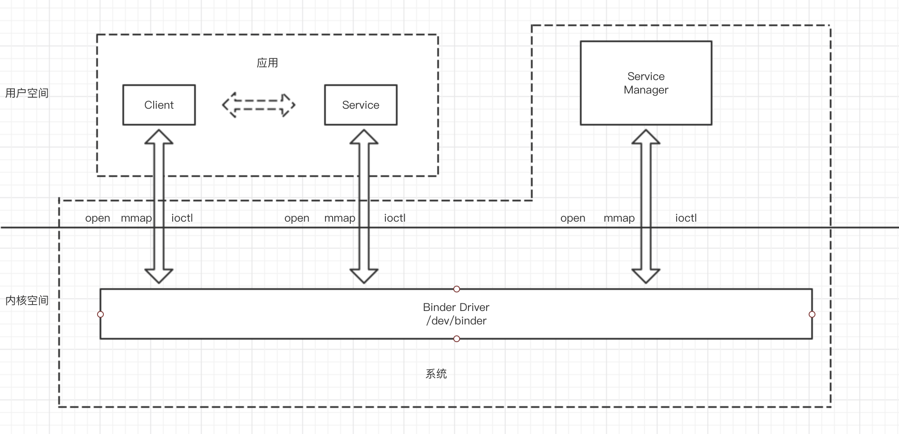
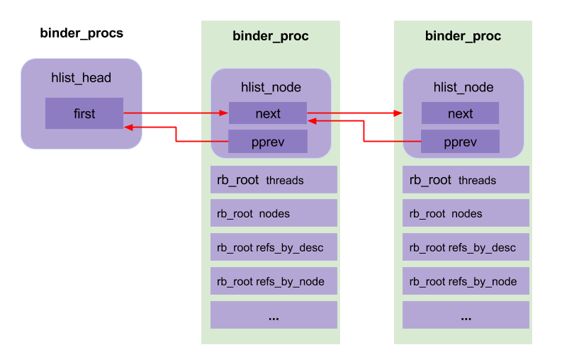
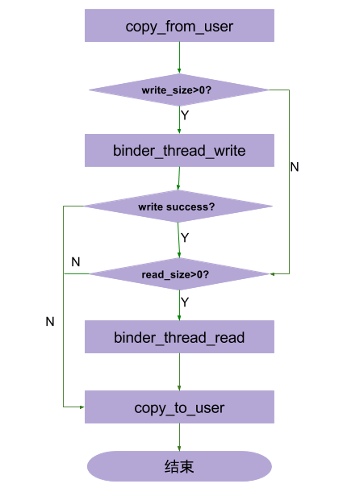
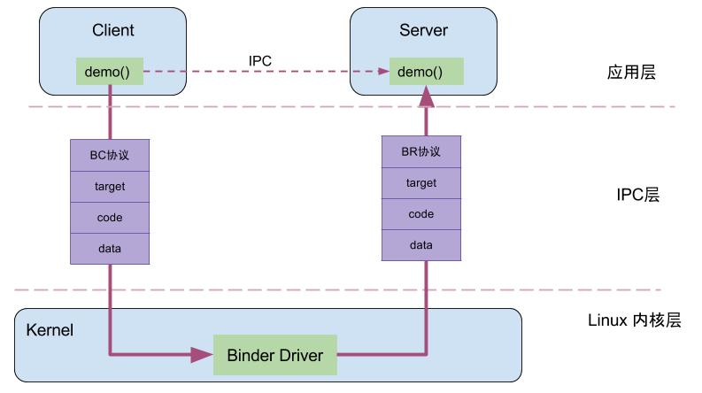
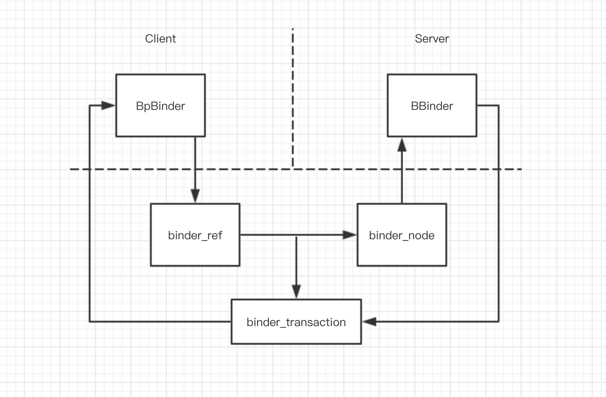

Binder是Android系统提供的一种IPC机制，是Android系统中的最重要的组成。

Binder进程间通信机制主要涉及到Client、Service、Service Manager和Binder驱动程序。它们的关系如下图：



Client、Service和Service Manager运行在用户空间，而Binder驱动程序运行在内核空间。Client、Service和Service Manager均是通过系统调用open、mmap和ioctl来访问设备文件/dev/binder，从而实现与Binder驱动程序的交互，而交互的目的就是为了能够间接地执行进程间通信。


## Binder驱动
### 一、Binder设备的初始化(binder_init)
Binder设备的初始化是在Binder驱动程序的初始化函数binder_init中进行。主要工作就是在目标设备上创建一个Binder设备文件/dev/binder，这个设备文件的操作方法列表由全局变量`binder_fops`指定，主要提供`binder_open`、`binder_mmap`和`binder_ioctl`。

```
static const struct file_operations binder_fops = {
    .owner = THIS_MODULE,
    .poll = binder_poll,
    .unlocked_ioctl = binder_ioctl,
    .compat_ioctl = binder_ioctl,
    .mmap = binder_mmap,
    .open = binder_open,
    .flush = binder_flush,
    .release = binder_release,
};
```
创建一个/proc/binder/proc目录，每一个使用了Binder进程间通信的进程在该目录下都会有一个对应文件，以进程ID命名，通过它们可以读取到每个进程的Binder线程池、Binder实体对象、Binder引用对象及内核缓冲区等信息。

### 二、Binder设备的打开过程(binder_open)
一个进程在使用Binder之前，要调用open打开设备文件/dev/binder来获得一个[文件描述符](https://david1840.github.io/2018/07/21/Linux%E6%96%87%E4%BB%B6%E6%8F%8F%E8%BF%B0%E7%AC%A6/)，然后才能通过这个文件描述符来和Binder驱动程序交互。

```
static int binder_open(struct inode *nodp, struct file *filp)
{
    struct binder_proc *proc; 

    proc = kzalloc(sizeof(*proc), GFP_KERNEL); // 为binder_proc结构体在分配kernel内存空间
    if (proc == NULL)
        return -ENOMEM;
    get_task_struct(current);
    proc->tsk = current;   //将当前线程的task保存到binder进程的tsk
    INIT_LIST_HEAD(&proc->todo); //初始化todo列表
    init_waitqueue_head(&proc->wait); //初始化wait队列
    proc->default_priority = task_nice(current);  //将当前进程的nice值转换为进程优先级

    binder_lock(__func__);   //同步锁，因为binder支持多线程访问
    binder_stats_created(BINDER_STAT_PROC); //BINDER_PROC对象创建数加1
    hlist_add_head(&proc->proc_node, &binder_procs); //将proc_node节点添加到binder_procs为表头的队列
    proc->pid = current->group_leader->pid;
    INIT_LIST_HEAD(&proc->delivered_death); //初始化已分发的死亡通知列表
    filp->private_data = proc;       //file文件指针的private_data变量指向binder_proc数据
    binder_unlock(__func__); //释放同步锁

    return 0;
}
```

创建`binder_proc`对象，并把当前进程等信息保存到`binder_proc`对象，该对象管理IPC所需的各种信息并拥有其他结构体的根结构体；再把`binder_proc`对象保存到文件指针`filp`，以及把`binder_proc`加入到全局链表`binder_procs`。


### 三、内存映射([binder_mmap](https://david1840.github.io/2018/07/16/%E5%86%85%E5%AD%98%E6%98%A0%E5%B0%84mmap/))
首先在内核虚拟地址空间申请一块与用户虚拟内存相同大小的内存，然后再申请一个page大小的物理内存，再将同一块物理内存分别映射到内核虚拟地址空间和用户虚拟空间，从而实现了用户空间的Buffer和内核空间Buffer同步操作的功能。

### 四、IO控制(binder_ioctl)
binder_ioctl()函数负责在两个进程间收发IPC数据和IPC reply数据。


```
static long binder_ioctl(struct file *filp, unsigned int cmd, unsigned long arg)
{
    int ret;
    struct binder_proc *proc = filp->private_data;
    struct binder_thread *thread;  // binder线程
    unsigned int size = _IOC_SIZE(cmd);
    void __user *ubuf = (void __user *)arg;
    //进入休眠状态，直到中断唤醒
    ret = wait_event_interruptible(binder_user_error_wait, binder_stop_on_user_error < 2);
    if (ret)
        goto err_unlocked;

    binder_lock(__func__);
    //获取binder_thread【见2.4.1】
    thread = binder_get_thread(proc);
    if (thread == NULL) {
        ret = -ENOMEM;
        goto err;
    }

    switch (cmd) {
    case BINDER_WRITE_READ:  //进行binder的读写操作
        ......
        break;
    case BINDER_SET_MAX_THREADS: //设置binder最大支持的线程数
        ......
        break;
    case BINDER_SET_CONTEXT_MGR: //成为binder的上下文管理者，也就是ServiceManager成为守护进程
        ......
        break;
    case BINDER_THREAD_EXIT:   //当binder线程退出，释放binder线程
        ......
        break;
    case BINDER_VERSION: {  //获取binder的版本号
        ......
        break;
    }
    default:
        ret = -EINVAL;
        goto err;
    }
    ret = 0;
err:
    if (thread)
        thread->looper &= ~BINDER_LOOPER_STATE_NEED_RETURN;
    binder_unlock(__func__);
    wait_event_interruptible(binder_user_error_wait, binder_stop_on_user_error < 2);

err_unlocked:
    trace_binder_ioctl_done(ret);
    return ret;
}
```

```
case BINDER_WRITE_READ: {
		struct binder_write_read bwr;
		if (size != sizeof(struct binder_write_read)) {
			ret = -EINVAL;
			goto err;
		}
		if (copy_from_user(&bwr, ubuf, sizeof(bwr))) { //把用户空间数据ubuf拷贝到bwr
			ret = -EFAULT;
			goto err;
		}
		binder_debug(BINDER_DEBUG_READ_WRITE,
			     "binder: %d:%d write %ld at %08lx, read %ld at %08lx\n",
			     proc->pid, thread->pid, bwr.write_size, bwr.write_buffer,
			     bwr.read_size, bwr.read_buffer);

		if (bwr.write_size > 0) {
		    //当写缓存中有数据，则执行binder写操作
			ret = binder_thread_write(proc, thread, (void __user *)bwr.write_buffer, bwr.write_size, &bwr.write_consumed);
			trace_binder_write_done(ret);
			if (ret < 0) {//当写失败，再将bwr数据写回用户空间，并返回
				bwr.read_consumed = 0;
				if (copy_to_user(ubuf, &bwr, sizeof(bwr)))
					ret = -EFAULT;
				goto err;
			}
		}
		if (bwr.read_size > 0) {
		    //当读缓存中有数据，则执行binder读操作
			ret = binder_thread_read(proc, thread, (void __user *)bwr.read_buffer, bwr.read_size, &bwr.read_consumed, filp->f_flags & O_NONBLOCK);
			trace_binder_read_done(ret);
			if (!list_empty(&proc->todo))
				wake_up_interruptible(&proc->wait);//唤醒等待状态的线程
			if (ret < 0) {//当读失败，再将bwr数据写回用户空间，并返回
				if (copy_to_user(ubuf, &bwr, sizeof(bwr)))
					ret = -EFAULT;
				goto err;
			}
		}
		binder_debug(BINDER_DEBUG_READ_WRITE,
			     "binder: %d:%d wrote %ld of %ld, read return %ld of %ld\n",
			     proc->pid, thread->pid, bwr.write_consumed, bwr.write_size,
			     bwr.read_consumed, bwr.read_size);
		if (copy_to_user(ubuf, &bwr, sizeof(bwr))) {
			ret = -EFAULT;
			goto err;
		}
		break;
	}
```

`BINDER_WRITE_READ`的流程如下：



* 首先，把用户空间数据ubuf拷贝到内核空间bwr；
* 当bwr写缓存有数据，则执行`binder_thread_write`；当写失败则将bwr数据写回用户空间并退出；
* 当bwr读缓存有数据，则执行`binder_thread_read`；当读失败则再将bwr数据写回用户空间并退出；
* 最后，把内核数据bwr拷贝到用户空间ubuf。

## Binder通信



Binder协议包含在IPC数据中，分为两类:

* `BINDER_COMMAND_PROTOCOL`：binder请求码，以”BC_“开头，简称BC码，用于从IPC层传递到Binder Driver层；
* `BINDER_RETURN_PROTOCOL` ：binder响应码，以”BR_“开头，简称BR码，用于从Binder Driver层传递到IPC层；

### 通信过程


其中binder_work.type共有6种类型：

```
BINDER_WORK_TRANSACTION //最常见类型
BINDER_WORK_TRANSACTION_COMPLETE
BINDER_WORK_NODE
BINDER_WORK_DEAD_BINDER
BINDER_WORK_DEAD_BINDER_AND_CLEAR
BINDER_WORK_CLEAR_DEATH_NOTIFICATION
```

### 通信对象
在Client和Server的一次通信过程中，涉及到4中类型对象。

Binder驱动程序中的Binder实体对象(`binder_node`),Binder引用对象(`binder_ref`)

Binder库中的Binder本地对象(`BBinder`),Binder代理对象(`BpBinder`)

