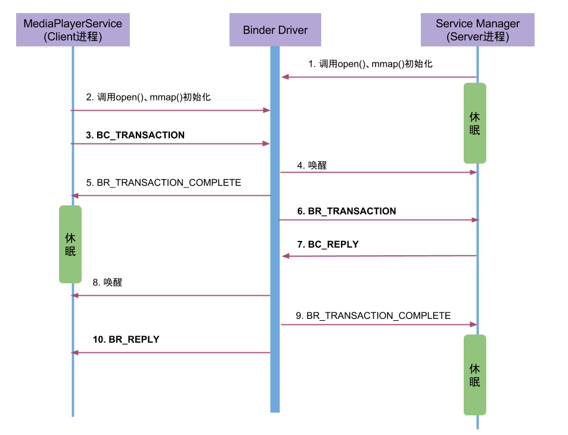

## 注册Service
Service组件运行在Server进程中，首先要将Service注册到Service Manager中，再启动一个Binder线程池来等待和处理Client的通信请求。

注册过程(addService)核心工作：在服务所在进程创建`binder_node`，在ServiceManager进程创建`binder_ref`.

以Media服务为例，注册的过程涉及到MediaPlayerService(作为Client进程)和Service Manager(作为Service进程)，通信流程图如下所示：

过程分析：

1. MediaPlayerService进程调用ioctl()向Binder驱动发送IPC数据，该过程可以理解成一个事务binder_transaction(记为T1)，执行当前操作的线程binder_thread(记为thread1)，则T1->from_parent=NULL，T1->from = thread1，thread1->transaction_stack=T1。其中IPC数据内容包含：

	* Binder协议为BC_TRANSACTION；
	* Handle等于0；
	* RPC代码为ADD_SERVICE；
	* RPC数据为”media.player”

2. Binder驱动收到该Binder请求，生成BR_TRANSACTION命令，选择目标处理该请求的线程，即ServiceManager的binder线程(记为thread2)，则 T1->to_parent = NULL，T1->to_thread = thread2。并将整个binder_transaction数据(记为T2)插入到目标线程的todo队列；
3. Service Manager的线程thread2收到T2后，调用服务注册函数将服务”media.player”注册到服务目录中。当服务注册完成后，生成IPC应答数据(BC_REPLY)，T2->form_parent = T1，T2->from = thread2, thread2->transaction_stack = T2。
4. Binder驱动收到该Binder应答请求，生成BR_REPLY命令，T2->to_parent = T1，T2->to_thread = thread1, thread1->transaction_stack = T2。 在MediaPlayerService收到该命令后，知道服务注册完成便可以正常使用。

## 获取Service
请求服务(getService)过程，就是向servicemanager进程查询指定服务，当执行binder_transaction()时，会区分请求服务所属进程情况。

1. 当请求服务的进程与服务属于不同进程，则为请求服务所在进程创建`binder_ref`对象，指向服务进程中的`binder_node`;
	* 最终readStrongBinder()，返回的是BpBinder对象；
2. 当请求服务的进程与服务属于同一进程，则不再创建新对象，只是引用计数加1，并且修改type为`BINDER_TYPE_BINDER`或`BINDER_TYPE_WEAK_BINDER`。
	* 最终readStrongBinder()，返回的是BBinder对象的真实子类；
