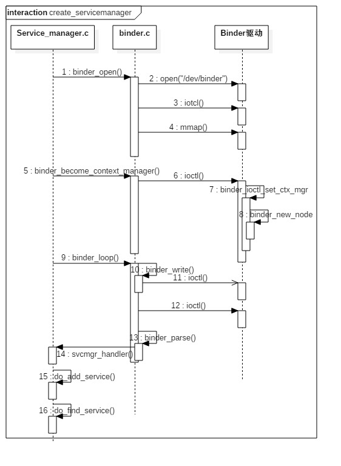

在[Binder机制简析(一)](https://david1840.github.io/2018/08/02/Binder%E6%9C%BA%E5%88%B6%E7%AE%80%E6%9E%90-%E4%B8%80/)中大概分析了Binder驱动，本章主要分析Service Manager。

# Service Manager
它扮演着Binder进程间通信机制上下文管理者的角色，同时负责管理系统中的Service组件，并且向Client组件提供获取Service代理对象的服务(主要工作：查询和注册服务)

## Service Manager启动

主要有下面几个步骤：

1. `binder_open` 打开驱动，将其映射到本进程的地址空间。
2. `binder_become_context_manager` 注册为binder服务的大管家
3. `binder_loop` 进入无限循环，处理从Client进程(Service和Client组件对Service Manager来说都是Client进程)通信请求。（循环调用`binder_thread_read`来检查Service Manager进程是否有新的进程间通信请求需要处理，如果有就交给`binder_parse`方法处理，在`binder_parse`中调用`svcmgr_handler`来解析信息，调用对应的方法，查询服务、注册服务、列举所有服务）

流程图：



### main
```
int main(int argc, char **argv) {
    struct binder_state *bs;
    //打开binder驱动，申请128k字节大小的内存空间 【见小节2.2】
    bs = binder_open(128*1024);
    ...

    //成为上下文管理者
    if (binder_become_context_manager(bs)) {
        return -1;
    }

    selinux_enabled = is_selinux_enabled(); //selinux权限是否使能
    sehandle = selinux_android_service_context_handle();
    selinux_status_open(true);

    if (selinux_enabled > 0) {
        if (sehandle == NULL) {  
            abort(); //无法获取sehandle
        }
        if (getcon(&service_manager_context) != 0) {
            abort(); //无法获取service_manager上下文
        }
    }
    ...

    //进入无限循环，处理client端发来的请求
    binder_loop(bs, svcmgr_handler);
    return 0;
}
```


### binder_loop
```
void binder_loop(struct binder_state *bs, binder_handler func) {
    int res;
    struct binder_write_read bwr;
    uint32_t readbuf[32];

    bwr.write_size = 0;
    bwr.write_consumed = 0;
    bwr.write_buffer = 0;

    readbuf[0] = BC_ENTER_LOOPER;
    //将BC_ENTER_LOOPER命令发送给binder驱动，让Service Manager进入循环
    binder_write(bs, readbuf, sizeof(uint32_t));

    for (;;) {
        bwr.read_size = sizeof(readbuf);
        bwr.read_consumed = 0;
        bwr.read_buffer = (uintptr_t) readbuf;

        res = ioctl(bs->fd, BINDER_WRITE_READ, &bwr); //进入循环，不断地binder读写过程
        if (res < 0) {
            break;
        }

        // 解析binder信息 
        res = binder_parse(bs, 0, (uintptr_t) readbuf, bwr.read_consumed, func);
        if (res == 0) {
            break;
        }
        if (res < 0) {
            break;
        }
    }
}
```

### binder_parse
```
int binder_parse(struct binder_state *bs, struct binder_io *bio,
                 uintptr_t ptr, size_t size, binder_handler func)
{
    int r = 1;
    uintptr_t end = ptr + (uintptr_t) size;

    while (ptr < end) {
        uint32_t cmd = *(uint32_t *) ptr;
        ptr += sizeof(uint32_t);
        switch(cmd) {
        case BR_NOOP:  //无操作，退出循环
            break;
        case BR_TRANSACTION_COMPLETE:
            break;
        case BR_INCREFS:
        case BR_ACQUIRE:
        case BR_RELEASE:
        case BR_DECREFS:
            ptr += sizeof(struct binder_ptr_cookie);
            break;
        case BR_TRANSACTION: {
            struct binder_transaction_data *txn = (struct binder_transaction_data *) ptr;
            ...
            binder_dump_txn(txn);
            if (func) {
                unsigned rdata[256/4];
                struct binder_io msg; 
                struct binder_io reply;
                int res;
                
                bio_init(&reply, rdata, sizeof(rdata), 4);
                bio_init_from_txn(&msg, txn); //从txn解析出binder_io信息
                //func在这里就指向svcmgr_handler
                res = func(bs, txn, &msg, &reply);
                binder_send_reply(bs, &reply, txn->data.ptr.buffer, res);
            }
            ptr += sizeof(*txn);
            break;
        }
        case BR_REPLY: {
            struct binder_transaction_data *txn = (struct binder_transaction_data *) ptr;
            ...
            binder_dump_txn(txn);
            if (bio) {
                bio_init_from_txn(bio, txn);
                bio = 0;
            }
            ptr += sizeof(*txn);
            r = 0;
            break;
        }
        case BR_DEAD_BINDER: {
            struct binder_death *death = (struct binder_death *)(uintptr_t) *(binder_uintptr_t *)ptr;
            ptr += sizeof(binder_uintptr_t);
            // binder死亡消息
            death->func(bs, death->ptr);
            break;
        }
        case BR_FAILED_REPLY:
            r = -1;
            break;
        case BR_DEAD_REPLY:
            r = -1;
            break;
        default:
            return -1;
        }
    }
    return r;
}
```

### svcmgr_handler
```
int svcmgr_handler(struct binder_state *bs,
                   struct binder_transaction_data *txn,
                   struct binder_io *msg,
                   struct binder_io *reply)
{
    struct svcinfo *si; 
    uint16_t *s;
    size_t len;
    uint32_t handle;
    uint32_t strict_policy;
    int allow_isolated;
    ...
    
    strict_policy = bio_get_uint32(msg);
    s = bio_get_string16(msg, &len);
    ...

    switch(txn->code) {
    case SVC_MGR_GET_SERVICE:
    case SVC_MGR_CHECK_SERVICE: 
        s = bio_get_string16(msg, &len); //服务名
        //根据名称查找相应服务
        handle = do_find_service(bs, s, len, txn->sender_euid, txn->sender_pid);
        bio_put_ref(reply, handle);
        return 0;

    case SVC_MGR_ADD_SERVICE: 
        s = bio_get_string16(msg, &len); //服务名
        handle = bio_get_ref(msg); //handle
        allow_isolated = bio_get_uint32(msg) ? 1 : 0;
         //注册指定服务
        if (do_add_service(bs, s, len, handle, txn->sender_euid,
            allow_isolated, txn->sender_pid))
            return -1;
        break;

    case SVC_MGR_LIST_SERVICES: {  
        uint32_t n = bio_get_uint32(msg);

        if (!svc_can_list(txn->sender_pid)) {
            return -1;
        }
        si = svclist;
        while ((n-- > 0) && si)
            si = si->next;
        if (si) {
            bio_put_string16(reply, si->name);
            return 0;
        }
        return -1;
    }
    default:
        return -1;
    }

    bio_put_uint32(reply, 0);
    return 0;
}
```

该方法的功能：查询服务，注册服务，以及列举所有服务

## 核心工作

servicemanager的核心工作就是注册服务和查询服务:

### 注册服务
记录服务名和handle信息，保存到svclist列表
```
int do_add_service(struct binder_state *bs,
                   const uint16_t *s, size_t len,
                   uint32_t handle, uid_t uid, int allow_isolated,
                   pid_t spid)
{
    struct svcinfo *si;

    if (!handle || (len == 0) || (len > 127))
        return -1;

    //权限检查
    if (!svc_can_register(s, len, spid)) {
        return -1;
    }

    //服务检索
    si = find_svc(s, len);
    if (si) {
        if (si->handle) {
            svcinfo_death(bs, si); //服务已注册时，释放相应的服务
        }
        si->handle = handle;
    } else {
        si = malloc(sizeof(*si) + (len + 1) * sizeof(uint16_t));
        if (!si) {  //内存不足，无法分配足够内存
            return -1;
        }
        si->handle = handle;
        si->len = len;
        memcpy(si->name, s, (len + 1) * sizeof(uint16_t)); //内存拷贝服务信息
        si->name[len] = '\0';
        si->death.func = (void*) svcinfo_death;
        si->death.ptr = si;
        si->allow_isolated = allow_isolated;
        si->next = svclist; // svclist保存所有已注册的服务
        svclist = si;
    }

    //以BC_ACQUIRE命令，handle为目标的信息，通过ioctl发送给binder驱动
    binder_acquire(bs, handle);
    //以BC_REQUEST_DEATH_NOTIFICATION命令的信息，通过ioctl发送给binder驱动，主要用于清理内存等收尾工作。
    binder_link_to_death(bs, handle, &si->death);
    return 0;
}
```

注册服务的分以下3部分工作：

* `svc_can_register`：检查权限，检查selinux权限是否满足；
* `find_svc`：服务检索，根据服务名来查询匹配的服务；
* `svcinfo_death`：释放服务，当查询到已存在同名的服务，则先清理该服务信息，再将当前的服务加入到服务列表svclist；

### 查询服务
根据服务名查询相应的的handle信息

```
uint32_t do_find_service(struct binder_state *bs, const uint16_t *s, size_t len, uid_t uid, pid_t spid)
{
    //查询相应的服务 
    struct svcinfo *si = find_svc(s, len);

    if (!si || !si->handle) {
        return 0;
    }

    if (!si->allow_isolated) {
        uid_t appid = uid % AID_USER;
        //检查该服务是否允许孤立于进程而单独存在
        if (appid >= AID_ISOLATED_START && appid <= AID_ISOLATED_END) {
            return 0;
        }
    }

    //服务是否满足查询条件
    if (!svc_can_find(s, len, spid)) {
        return 0;
    }
    return si->handle;
}
```
查询到目标服务，并返回该服务所对应的handle

## 获取Service Manager代理

由于Service Manager本身也是一个Service组件，因此，其他Service组件和Client组件在使用它提供的组件之前，也要获取它的代理对象。Service Manager代理对象的类型为BpServiceManager，它用来描述一个实现了IServiceManager接口的Client组件。

IServiceManager接口定义了getService()、chaekService()、addService()、listService()方法。

Android系统在应用程序框架层的Binder库中提供了一个函数`defaultServiceManager()`，该方法为单例模式，保证一个进程中最多只有一个Service Manager代理对象。


```
sp<IServiceManager> defaultServiceManager()
{
    if (gDefaultServiceManager != NULL) return gDefaultServiceManager;
    {
        AutoMutex _l(gDefaultServiceManagerLock); //加锁
        while (gDefaultServiceManager == NULL) {
             //关键代码
            gDefaultServiceManager = interface_cast<IServiceManager>(ProcessState::self()->getContextObject(NULL));
            
            if (gDefaultServiceManager == NULL)
                sleep(1);
        }
    }
    return gDefaultServiceManager;
}
```
当尝试创建或获取ServiceManager时，ServiceManager可能尚未准备就绪，这时通过sleep 1秒后，循环尝试获取直到成功。

gDefaultServiceManager的创建过程,可分解为以下3个步骤：

1. `ProcessState::self()`：用于获取ProcessState对象(也是单例模式)，每个进程有且只有一个ProcessState对象，存在则直接返回，不存在则创建。

> 		ProcessState::self()主要工作：
> 			调用open()，打开/dev/binder驱动设备；
> 			再利用mmap()，创建大小为1M-8K的内存地址空间；
> 			设定当前进程最大的最大并发Binder线程个数为16。

2. `getContextObject()`： 用于获取BpBinder对象，对于handle=0的BpBinder对象，存在则直接返回，不存在才创建。
3. `interface_cast<IServiceManager>()`：用于获取BpServiceManager对象。

> 	在整个Binder系统中handle=0代表ServiceManager所对应的BBinder

`defaultServiceManager` 等价于 `new BpServiceManager(new BpBinder(0))`;