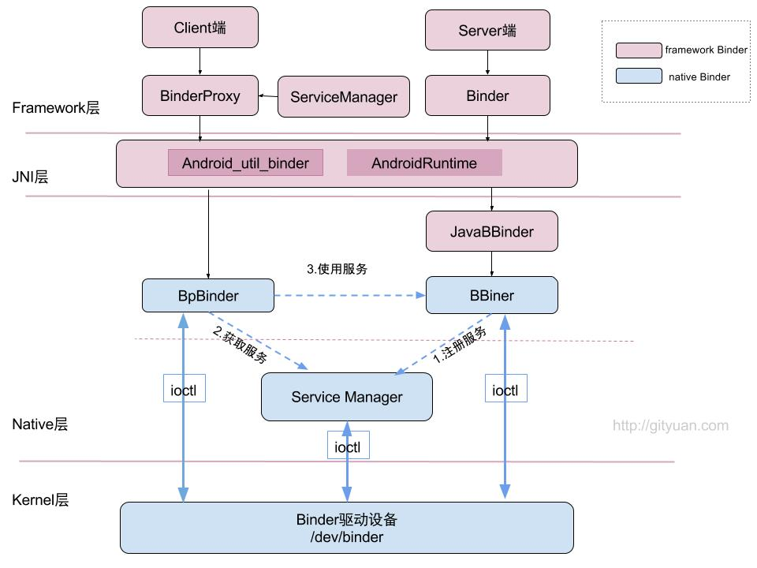

binder在framework层，采用JNI技术来调用native(C/C++)层的binder架构，从而为上层应用程序提供服务。 看过binder系列之前的文章，我们知道native层中，binder是C/S架构，分为Bn端(Server)和Bp端(Client)。对于java层在命名与架构上非常相近，同样实现了一套IPC通信架构。
## framework Binder架构图

图解：

1. 图中红色代表整个framework层 binder架构相关组件；
2. 图中蓝色代表Native层Binder架构相关组件；
3. 上层framework层的Binder逻辑是建立在Native层架构基础之上的，核心逻辑都是交予Native层方法来处理。
4. framework层的ServiceManager类与Native层的功能并不完全对应，framework层的ServiceManager类的实现最终是通过BinderProxy传递给Native层来完成的

## Binder完整通信流程

图解:

1. 发起端线程向Binder Driver发起binder ioctl请求后, 便采用环不断talkWithDriver,此时该线程处于阻塞状态, 直到收到如下BR_XXX命令才会结束该过程.
2. 左图中waitForResponse收到BR_TRANSACTION_COMPLETE,则直接退出循环, 则没有机会执行executeCommand()方法, 故将其颜色画为灰色. 除以上5种BR_XXX命令, 当收到其他BR命令,则都会执行executeCommand过程.
3. 目标Binder线程创建后, 便进入joinThreadPool()方法, 采用循环不断地循环执行getAndExecuteCommand()方法, 当bwr的读写buffer都没有数据时,则阻塞在binder_thread_read的wait_event过程. 另外,正常情况下binder线程一旦创建则不会退出.