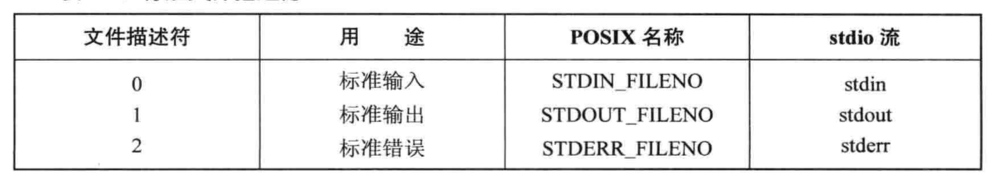

## 概述
在Linux系统中的一切都可以看成文件。对于内核而言，所有打开的文件都通过文件描述符引用。文件描述符是一个非负整数，当打开一个现有文件或是创建一个新的文件时，内核向进程返回一个文件描述符。

当读、写一个文件时，使用open或create返回的文件描述符标识该文件，并将其作为参数传递给read或write函数。

下图为标准文件描述符

## 文件描述符和打开文件之间的关系
每一个文件描述符会与一个打开文件相对应，同时，不同的文件描述符也会指向同一个文件。相同的文件可以被不同的进程打开也可以在同一个进程中被多次打开。系统为每一个进程维护了一个文件描述符表，该表的值都是从0开始的，所以在不同的进程中你会看到相同的文件描述符，这种情况下相同文件描述符有可能指向同一个文件，也有可能指向不同的文件。具体情况要具体分析，要理解具体其概况如何，需要查看由内核维护的3个数据结构。

	    1. 进程级的文件描述符表
	    2. 系统级的打开文件描述符表
	    3. 文件系统的i-node表

进程级的描述符表的每一条目记录了单个文件描述符的相关信息。

    1. 控制文件描述符操作的一组标志。（目前，此类标志仅定义了一个，即close-on-exec标志）
    2. 对打开文件句柄的引用
内核对所有打开的文件的文件维护有一个系统级的描述符表格（open file description table）。有时，也称之为打开文件表（open file table），并将表格中各条目称为打开文件句柄（open file handle）。一个打开文件句柄存储了与一个打开文件相关的全部信息，如下所示：

	1. 当前文件偏移量（调用read()和write()时更新，或使用lseek()直接修改）
	2. 打开文件时所使用的状态标识（即，open()的flags参数）
	3. 文件访问模式（如调用open()时所设置的只读模式、只写模式或读写模式）
	4. 与信号驱动相关的设置
	5. 对该文件i-node对象的引用
	6. 文件类型（例如：常规文件、套接字或FIFO）和访问权限
	7. 一个指针，指向该文件所持有的锁列表
	8. 文件的各种属性，包括文件大小以及与不同类型操作相关的时间戳

下图展示了文件描述符、打开的文件句柄以及i-node之间的关系，图中，两个进程拥有诸多打开的文件描述符。

	
在进程A中，文件描述符1和30都指向了同一个打开的文件句柄（标号23）。这可能是通过调用dup()、dup2()、fcntl()或者对同一个文件多次调用了open()函数而形成的。 
    进程A的文件描述符2和进程B的文件描述符2都指向了同一个打开的文件句柄（标号73）。这种情形可能是在调用fork()后出现的（即，进程A、B是父子进程关系），或者当某进程通过UNIX域套接字将一个打开的文件描述符传递给另一个进程时，也会发生。再者是不同的进程独自去调用open函数打开了同一个文件，此时进程内部的描述符正好分配到与其他进程打开该文件的描述符一样。 
    此外，进程A的描述符0和进程B的描述符3分别指向不同的打开文件句柄，但这些句柄均指向i-node表的相同条目（1976），换言之，指向同一个文件。发生这种情况是因为每个进程各自对同一个文件发起了open()调用。同一个进程两次打开同一个文件，也会发生类似情况。
    
## 总结
1. 由于进程级文件描述符表的存在，不同的进程中会出现相同的文件描述符，它们可能指向同一个文件，也可能指向不同的文件
2. 两个不同的文件描述符，若指向同一个打开文件句柄，将共享同一文件偏移量。因此，如果通过其中一个文件描述符来修改文件偏移量（由调用read()、write()或lseek()所致），那么从另一个描述符中也会观察到变化，无论这两个文件描述符是否属于不同进程，还是同一个进程，情况都是如此。
3. 要获取和修改打开的文件标志（例如：O_APPEND、O_NONBLOCK和O_ASYNC），可执行fcntl()的F_GETFL和F_SETFL操作，其对作用域的约束与上一条颇为类似。
4. 文件描述符标志（即，close-on-exec）为进程和文件描述符所私有。对这一标志的修改将不会影响同一进程或不同进程中的其他文件描述符

部分转载自 http://blog.csdn.net/cywosp/article/details/38965239