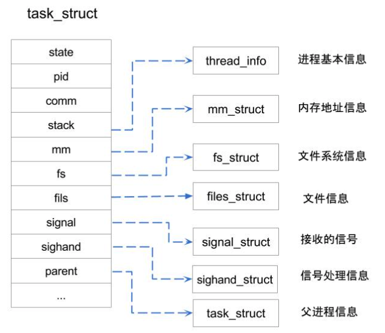
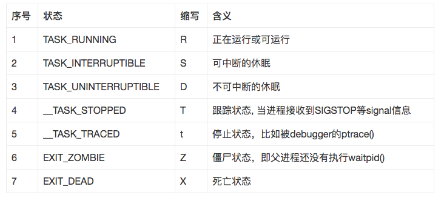
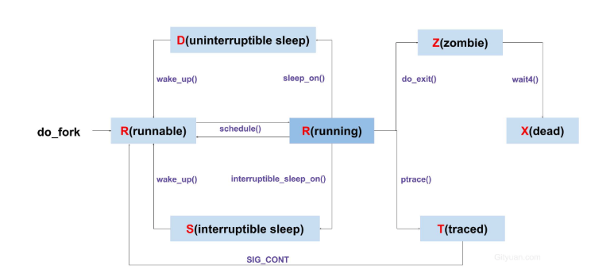

## 进程
进程就是处于执行期的程序(目标码存放在某种存储介质上)，还包含像打开的文件、挂起的信号、内核内部数据、处理器状态等。实际上，进程就是正在执行的程序代码的实时结果。内核需要有效而透明地管理所有细节。

执行线程，简称线程，是在进程中活动的对象。每个线程都拥有一个独立的程序计数器、进程栈和一组进程寄存器。内核调度的对象是线程而不是进程。Linux系统的线程实现非常特别：它对线程和进程并不特别区别。对Linux而言，线程不过就是一种特殊的进程。

* 虚拟处理器：多个进程共享同一个处理器，但虚拟处理器给进程一种独占的感觉；
* 虚拟内存：多进程分享整个内存，但虚拟内存给进程以独占整个内存空间的感觉；

**进程是处于执行期的程序以及相关资源的总称。**

## 进程描述符及任务结构

内核把进程的列表存放在叫做任务队列(task list)的双向循环链表中。链表中的每一项都是类型为task_struct、称为进程描述符的结构，该结构定义在<linux/sched.h>文件中。进程描述符中包含一个具体进程的所有信息。

## 进程状态

进程描述符中的state域描述了进程的当前状态。最新的kernel进程状态值有：

* R状态: 分为正在执行和RQ队列等待执行两种状态，该状态是唯一可执行的状态；
* D状态：不影响任何信号，如果分析过一些系统冻屏/死机重启的案例，会发现很多时候是由于某个进程异常处于D状态而导致系统blocked。 即便如此，也有其存在的价值，比如当进程打开设备驱动文件时，在驱动程序执行完成之前是 不希望被打断的，可能会出现不可预知的状态。
* Z状态：出现这个状态往往是父进程没有执行waitpid()或wait4()系统调用， 在这种情况下，内核不会丢弃该死亡进程的信息，系统无法判断是父进程是否还需要该信息。

进程状态转换图：

## 进程创建

Linux进程创建： 通过fork()系统调用创建进程

Linux用户级线程创建：通过pthread库中的pthread_create()创建线程

Linux内核线程创建： 通过kthread_create()创建内核线程