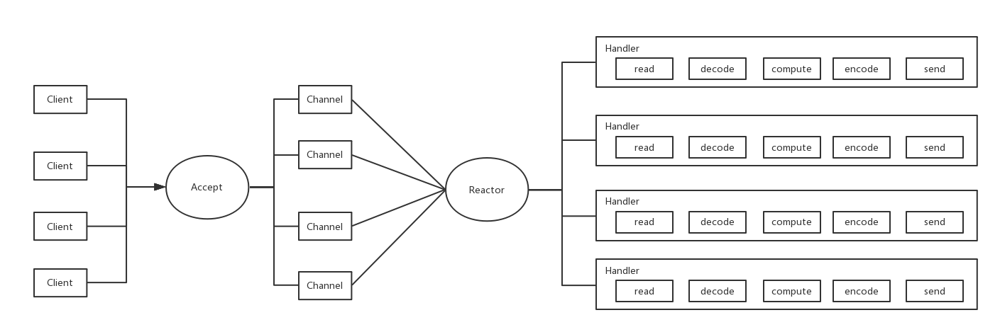
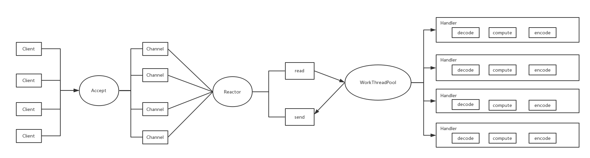
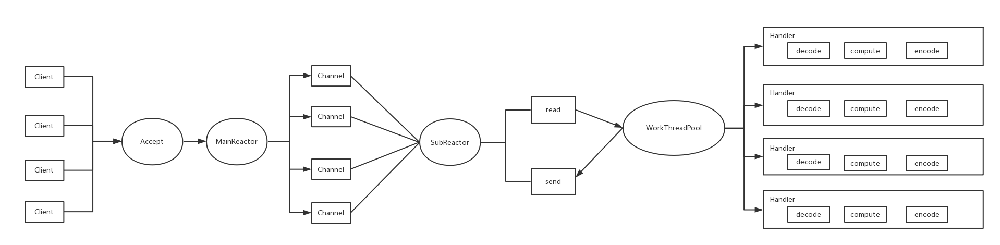

Reactor模型的中心思想是将所有要处理的IO事件及其处理器注册到一个中心的IO多路复用器上，并将主线程阻塞在多路复用器上；当有相应的IO事件到达时，多路复用器将IO事件分发给相应的处理器进行处理。

Reactor模型几个重要组件：

* Reactor：IO事件的派发者，相当于有分发功能的Selector。
* Accept：接受Client的连接，建立对应Client的Handler，并向Reactor注册此Handler。
* Handler：和一个Client通讯的实体。

Reactor有三种线程模型：

## Reactor单线程模型

单线程模式单线程模式是最简单的Reactor模型。Reactor 线程是个多面手，负责多路分离套接字，Accept 新连接，并分派请求到处理器链中。这种单线程模型不能充分利用多核资源，所以实际使用的不多。

## Reactor多线程模型

将Handler中的IO操作和非IO操作分开，客户端的请求会直接丢到线程池中。但当客户端进一步增加，Reactor上就会出现瓶颈，它既处理IO操作请求又响应连接请求。

## 主从Reactor多线程模型

主Reactor用于处理连接请求，从Reactor用于处理IO操作请求。

Netty就是一个实现了Reactor模型的框架，其内部可以根据配置选择使用哪种模型。