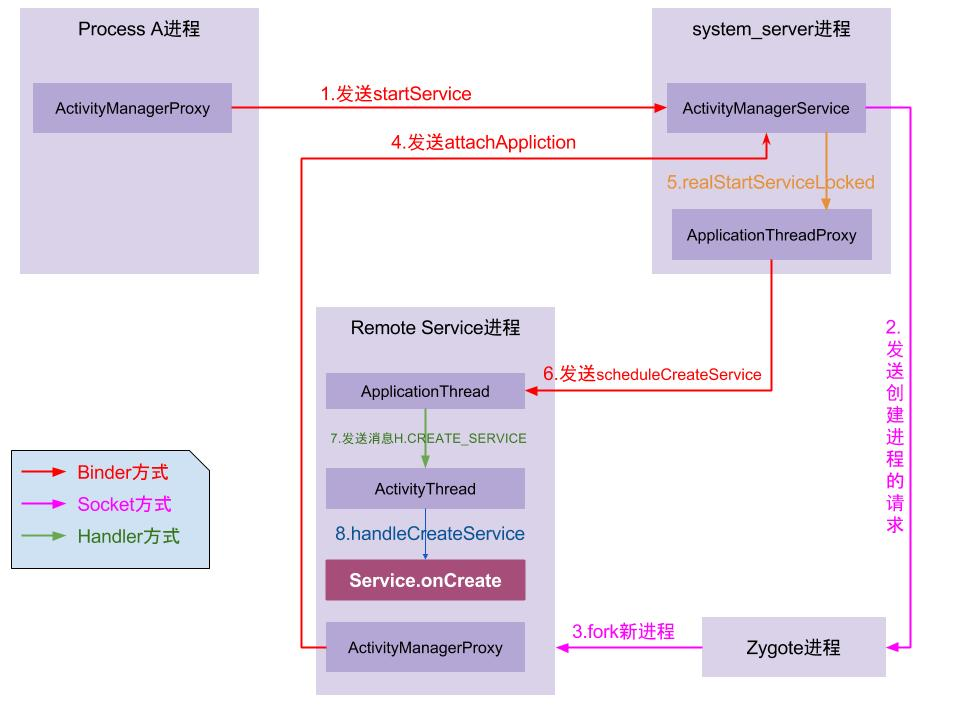

Service有两种启动方式startService()和bindService()

## startService

启动流程：

1. Process A进程采用Binder IPC向system_server进程发起startService请求；
2. system_server进程接收到请求后，向zygote进程发送创建进程的请求；
3. zygote进程fork出新的子进程Remote Service进程；
4. Remote Service进程，通过Binder IPC向sytem_server进程发起attachApplication请求；
5. system_server进程在收到请求后，进行一系列准备工作后，再通过binder IPC向remote Service进程发送scheduleCreateService请求；
6. Remote Service进程的binder线程在收到请求后，通过handler向主线程发送CREATE_SERVICE消息；
7. 主线程在收到Message后，通过发射机制创建目标Service，并回调Service.onCreate()方法。

## bindService
当一个Service组件被一个Activity或一个Service启动时，可以将它们绑定起来，以便启动者方便地得到它的访问接口。

调用流程图：

1. 图中蓝色代表的是Client进程(发起端), 红色代表的是system_server进程, 黄色代表的是target进程(service所在进程);

2. Client进程: 通过getServiceDispatcher获取Client进程的匿名Binder服务端，即LoadedApk.ServiceDispatcher.InnerConnection,该对象继承于IServiceConnection.Stub； 再通过bindService调用到system_server进程;

3. system_server进程: 依次通过scheduleCreateService和scheduleBindService方法, 远程调用到target进程; 
4. target进程: 依次执行onCreate()和onBind()方法; 将onBind()方法的返回值IBinder(作为target进程的binder服务端)通过publishService传递到system_server进程;
5. system_server进程: 利用IServiceConnection代理对象向Client进程发起connected()调用, 并把target进程的onBind返回Binder对象的代理端传递到Client进程;
6. Client进程: 回调到onServiceConnection()方法, 该方法的第二个参数便是target进程的binder代理端. 到此便成功地拿到了target进程的代理, 可以畅通无阻地进行交互.