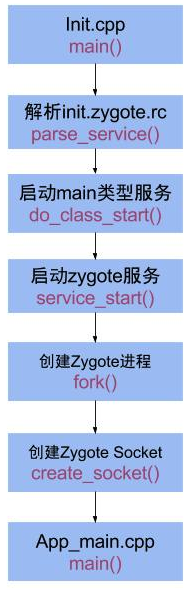

# Zygote
Android中所有的应用程序进程都是由Zygote进程通过复制自身的方式创建的，因此将它称为进程孵化器。Zygote进程是Android系统的第一个进程init启动的。
## init进程
init是Linux系统中用户空间的第一个进程，进程号为1。kernel启动后，在用户空间启动init进程，并调用main()方法执行init的职责：</br>
> 1. 分析和运行所有的init.rc文件</br>
> 2. 生成设备驱动节点(通过rc文件创建)</br>
> 3. 处理子进程的终止</br>
> 4. 提供属性服务(property)</br>

## 启动Zygote服务

### 启动脚本
在init.zygote.rc文件中定义了Zygote服务：

```
service zygote /system/bin/app_process -Xzygote /system/bin --zygote --start-system-server
    socket zygote stream 660 root system
```
第一行表示Zygote进程是以服务的方式启动，对应应用程序文件是/system/bin/app_process,`start-system-server`表示Zygote进程启动结束后需要将System进程也启动。

第二行表示在启动过程中创建一个名为“zygote”的Socket。这个Socket用来执行进程间通信。AMS就是通过这个Socket来请求Zygote进程创建新的应用程序进程的。

   

### 进程启动


1. 解析init.zygote.rc中的参数，创建AppRuntime并调用AppRuntime.start()方法；
2. 调用AndroidRuntime的startVM()方法创建虚拟机，再调用startReg()注册JNI函数；
3. 通过JNI方式调用ZygoteInit.main()，第一次进入Java世界；
4. registerZygoteSocket()建立socket通道，zygote作为通信的服务端，用于响应客户端请求；
5. preload()预加载通用类、drawable和color资源、openGL以及共享库以及WebView，用于提高app启动效率；
6. zygote完毕大部分工作，接下来再通过startSystemServer()，fork得力帮手system_server进程，也是上层framework的运行载体。
7. zygote功成身退，调用runSelectLoop()，随时待命，当接收到请求创建新进程请求时立即唤醒并执行相应工作。


# SystemServer
Zygote进程启动中fork了SystemServer，进程名为system_server，该进程承载着framework的核心服务。

在SystemServer启动过程中加载各种系统服务。


> 1. startBootstrapServices()  //引导服务
> 2. startCoreServices().      //核心服务
> 3. startOtherServices().     //其他服务


引导服务(7个)：[ActivityManagerService](https://david1840.github.io/2018/07/20/ActivityManagerService/)、PowerManagerService、LightsService、DisplayManagerService、PackageManagerService、UserManagerService、SensorService；</br>
核心服务(3个)：BatteryService、UsageStatsService、WebViewUpdateService；</br>
其他服务(70个+)：AlarmManagerService、VibratorService等。

所有服务启动完成即系统启动完成，调用`AMS.finishBooting()`,system_server进程进入Looper.loop()状态，等待消息到来。

# 参考资料：
[Android系统启动-zygote篇 Gityuan](http://gityuan.com/2016/02/13/android-zygote/)、《Android系统源代码情景分析》