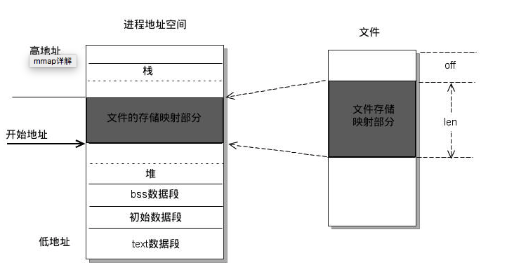
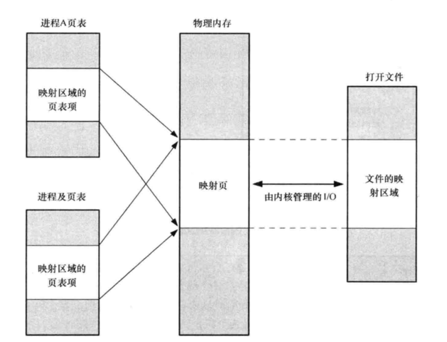
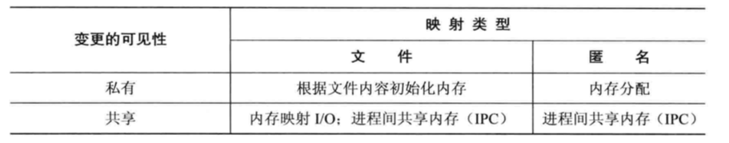

## 概述
内存映射简单来说就是将内核空间的一段内存区域映射到用户空间，这样用户对这段内存区域的修改可以直接反映到内核空间，相反，内核空间对这段区域的修改也可以反映到用户空间。在这样对于内核空间和用户空间之间需要大量数据传输等操作的话效率非常高。

mmap()函数就是在Linux系统中用来实现内存映射的。

映射分为两种： 
* **文件映射**：将一个文件的一部分直接映射到调用进程的虚拟内存中。一旦一个文件被映射后就可以通过在相应的内存区域中操作字节来访问文件内容了。 
* **匿名映射**：一个匿名映射没有对应的文件。（就是用户空间需要分配一定的物理内存来存储数据,这部分内存不属于任何文件,内核就使用匿名映射将内存中的某段物理地址与用户空间一一映射,这样用户就可用直接操作虚拟地址范围的这段物理内存） 

在代码中,文件映射的操作就是:open,read,write,close,mmap... 操作的虚拟地址都属于文件映射。  malloc 分配的虚拟地址属于匿名映射. 

## mmap()函数
用户空间mmap()函数`void *mmap(void *addr, size_t length, int prot, int flags,int fd, off_t offset)`，下面就其参数解释如下：

start：用户进程中要映射的用户空间的起始地址，通常为NULL（由内核来指定） 
length：要映射的内存区域的大小 
prot：期望的内存保护标志 
flags：指定映射对象的类型 
fd：文件描述符（由open函数返回） 
offset：设置在内核空间中已经分配好的的内存区域中的偏移，例如文件的偏移量，大小为PAGE_SIZE的整数倍 
返回值：mmap()返回被映射区的指针，该指针就是需要映射的内核空间在用户空间的虚拟地址 

## 映射共享

一个进程的映射中的内存可以与其他进程中的映射共享（即各个进程的页表条目指向RAM中相同分页）。这种情况会在两种情况下发生：

1. 当两个进程映射了同一个文件的同一个区域时它们会共享物理内存的相同分页。
2. 通过fork()创建的子进程会继承其父进程的映射的副本，并且这些映射所引用的物理内存分页与父进程中相应映射所引用的分页相同。

当两个或更多个进程共享相同分页时，每个进程都有可能看到其他进程对分页内容做出的变更，当然要取决于映射是私有的还是共享的。

* 私有映射(MAP_PRIVATE)：在映射内容上发生的变更对其他进程不可见，对于文件映射来说，变更将不会在底层文件上进行。内核使用写时复制(copy-on-write)技术完成了这个任务。这意味着当一个进程试图修改一个分页的内容时，内核首先会为该进程创建一个新的分页并将需要修改的分页中的数据复制到新分页中。
* 共享映射(MAP_SHARED)：变更对所有共享映射的进程可见。

## 各种内存映射的用途

