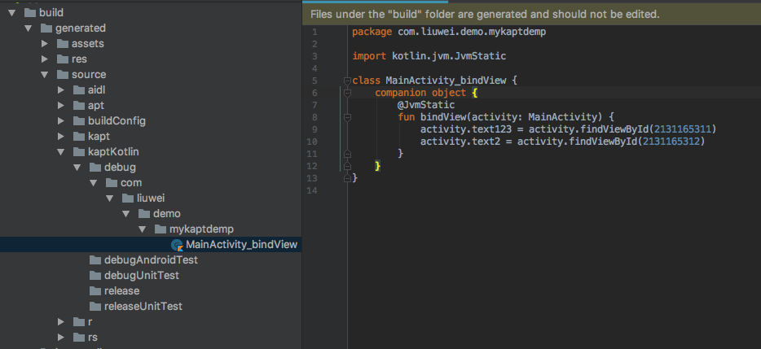

## 注解
一个注解允许你把额外的元数据关联到一个声明上。然后元数据就可以被相关的源代码工具访问，通过编译好的类文件或是在运行时，取决于这个注解是如何配置的。   --《Kotlin in Action》

注解（也被成为元数据）为我们在代码中添加信息提供了一种形式化的方法，使我们可以在稍后某个时刻非常方便地使用这些数据。 --《Thinging in Java》

在Java和Kotlin中声明注解的方式还是有些差异：

```
Java:
public @interface MyAnnotation {
}

public @interface MyAnnotation2{
	String value();
}

Kotlin:
annotation class MyAnnotation

annotation class MyAnnotation2(val value:String)
```

## 元注解
可以应用到注解类上的注解被称为元注解。</br>
比较常见的元注解有`@Target、@Retention`

```
@Target(AnnotationTarget.ANNOTATION_CLASS)
@MustBeDocumented
public annotation class Target(vararg val allowedTargets: AnnotationTarget)

```

```
public enum class AnnotationTarget {
    /** Class, interface or object, annotation class is also included */
    CLASS,
    /** Annotation class only */
    ANNOTATION_CLASS,
    /** Generic type parameter (unsupported yet) */
    TYPE_PARAMETER,
    /** Property */
    PROPERTY,
    /** Field, including property's backing field */
    FIELD,
    /** Local variable */
    LOCAL_VARIABLE,
    /** Value parameter of a function or a constructor */
    VALUE_PARAMETER,
    /** Constructor only (primary or secondary) */
    CONSTRUCTOR,
    /** Function (constructors are not included) */
    FUNCTION,
    /** Property getter only */
    PROPERTY_GETTER,
    /** Property setter only */
    PROPERTY_SETTER,
    /** Type usage */
    TYPE,
    /** Any expression */
    EXPRESSION,
    /** File */
    FILE,
    /** Type alias */
    @SinceKotlin("1.1")
    TYPEALIAS
}
```

Target表明你的注解可以被应用的元素类型，包括类、文件、函数、属性等，如果需要你可以声明多个对象。

```
@Target(AnnotationTarget.ANNOTATION_CLASS)
public annotation class Retention(val value: AnnotationRetention = AnnotationRetention.RUNTIME)

```

```
public enum class AnnotationRetention {
    /** Annotation isn't stored in binary output */
    SOURCE,
    /** Annotation is stored in binary output, but invisible for reflection */
    BINARY,
    /** Annotation is stored in binary output and visible for reflection (default retention) */
    RUNTIME
}
```

Retention被用来说明你声明的注解是否会被存储到.class文件，以及在运行时是否可以通过反射来访问它。

## 注解分类
从取值的方式来说可以分为两类：编译时注解和运行时注解。

### 运行时注解
使用反射在程序运行时操作。目前最著名的使用运行时注解的开源库就是Retrofit。（由于运行时注解使用了反射，必然会影响到效率)

### 编译时注解
顾名思义，就是编译时去处理的注解。dagger，butterKnife，包括谷data binding，都用到了编译时注解。其核心就是编译时注解+APT+动态生成字节码。

## APT和KAPT

APT (Annotation Processor Tool):注解处理器是一个在javac中的，用来编译时扫描和处理的注解的工具。你可以为特定的注解，注册你自己的注解处理器。</br>
注解处理器可以生成Java代码，这些生成的Java代码会组成 .java 文件，但不能修改已经存在的Java类（即不能向已有的类中添加方法）。而这些生成的Java文件，会同时与其他普通的手写Java源代码一起被javac编译。</br>
KAPT与APT完全相同，只是在Kotlin下的注解处理器。


## 实例
使用编译时注解+APT+动态生成字节码完成了一个butterKnife最基础的findViewById的功能，适合入门学习。

### 一、声明注解
在项目中新建一个java library，声明两个注解，一个用来注解类，一个用来注解。

```
@Target(AnnotationTarget.CLASS)
@Retention(AnnotationRetention.SOURCE)
annotation class MyClass


@Target(AnnotationTarget.FIELD)
@Retention(AnnotationRetention.SOURCE)
annotation class findView(val value: Int = -1)

```

使用注解

```
@MyClass
class MainActivity : Activity() {

    @findView(R.id.text1)
    var text123: TextView? = null

    @findView(R.id.text2)
    var text2: TextView? = null

    override fun onCreate(savedInstanceState: Bundle?) {
        super.onCreate(savedInstanceState)
        setContentView(R.layout.activity_main)
    }
}
```

### 二、获取注解

创建一个类继承自AbstractProcessor


```
@AutoService(Processor::class)
@SupportedSourceVersion(SourceVersion.RELEASE_8)
class MyProcessor : AbstractProcessor() {
    
    override fun getSupportedAnnotationTypes(): Set<String> {
        return setOf(MyClass::class.java.canonicalName)
    }

    override fun init(processingEnv: ProcessingEnvironment) {
        super.init(processingEnv)
        
    }

    override fun process(annotations: MutableSet<out TypeElement>, roundEnv: RoundEnvironment): Boolean {

        return true
    }
}
```


### 三、动态生成字节码

使用[kotlinpoet](https://github.com/square/kotlinpoet)动态生成代码

```
 override fun process(annotations: MutableSet<out TypeElement>, roundEnv: RoundEnvironment): Boolean {
        mLogger.info("processor start")
		 //获取所有用@MyClass注解的类
        val elements = roundEnv.getElementsAnnotatedWith(MyClass::class.java)
        elements.forEach {
            val typeElement = it as TypeElement
            val members = elementUtils!!.getAllMembers(typeElement)

            //创建一个bingdView的方法，参数为activity，并使用JvmStatic注解
            val bindFunBuilder = FunSpec.builder("bindView").addParameter("activity", typeElement.asClassName()).addAnnotation(JvmStatic::class.java)


            members.forEach {
                //获取所有@findview注解的属性
                val find: findView? = it.getAnnotation(findView::class.java)
                if (find != null) {
                    mLogger.info("find annotation " + it.simpleName)
                    //方法中添加findviewById
                    bindFunBuilder.addStatement("activity.${it.simpleName} = activity.findViewById(${find.value})")
                }
            }
            val bindFun = bindFunBuilder.build()


            //生成一个由@MyClass注解的类的名称加_bindView后缀的类，其中有一个静态方法bindView
            val file = FileSpec.builder(getPackageName(typeElement), it.simpleName.toString()+"_bindView")
                    .addType(TypeSpec.classBuilder(it.simpleName.toString()+"_bindView")
                            .addType(TypeSpec.companionObjectBuilder()
                                    .addFunction(bindFun)
                                    .build())
                            .build())
                    .build()
            file.writeFile()
        }

        mLogger.info("end")
        return true
    }
```
编译代码，本例就会在build下生成一个MainActivity_bindView的类，其中有一个静态方法bindview，传入的参数是activity，方法中是我们注解的text123和text2的findviewById。只要在Activity启动时调用这个静态方法就可以实现View的绑定。



### 四、调用
在MainActivity中调用静态方法就可以绑定View，但是由于这个类是编译时生成的，在MainActivity中其实并不知道有这个类存在，无法直接调用。这个时候就要使用反射了。我们在生成类的时候使用“类名”+“_bindView”的方式，知道了静态方法的类名就可以使用反射执行方法了。


```
class MyKapt {
    companion object {
        fun bindView(target: Any) {
            val classs = target.javaClass
            val claName = classs.name + "_bindView"
            val clazz = Class.forName(claName)

            val bindMethod = clazz.getMethod("bindView", target::class.java)
            val ob = clazz.newInstance()
            bindMethod.invoke(ob, target)
        }
    }
}
```

MainActivity中：

```
 override fun onCreate(savedInstanceState: Bundle?) {
        super.onCreate(savedInstanceState)
        setContentView(R.layout.activity_main)
        MyKapt.bindView(this)
    }
```


搞定！这是我写的简单Demo
[项目Demo](https://github.com/David1840/MyKapt)